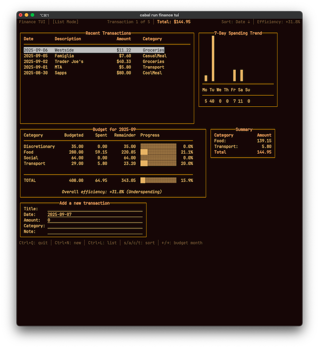

# finance

A CLI/TUI personal finance tracker built in Haskell that helps you track expenses, manage budgets, and analyze spending patterns.

*Note: this is a personal project made while I was learning Haskell. I cannot claim it is perfect, merely that it works well enough and incorporates a lot of crucial Haskell knowledge.*



## What This Project Does

This is a personal finance application that lets you:
- **Track transactions** - Add and view your expenses
- **Set budgets** - Create monthly budgets for different categories
- **Generate reports** - See spending summaries and trends
- **Analyze spending** - Compare actual spending vs. budgeted amounts

## For Haskell Beginners

This project demonstrates several key Haskell concepts:
- **Functional programming** - Pure functions, immutability, and composition
- **Type safety** - Strong static typing with custom data types
- **Monads** - Using `IO`, `Maybe`, and `Either` for effect handling
- **Parser combinators** - Command-line argument parsing with `optparse-applicative`
- **TUI development** - Building interactive interfaces with `brick`
- **Data processing** - Working with CSV files, YAML configuration, and time data

## Quick Start

### Installation & Setup

1. **Clone and build the project:**
   ```bash
   git clone https://github.com/jakebox/finance.git
   cd finance
   cabal build
   ```

2. **Set up your data files:**
   The app expects two files in the project directory:
   - `transactions.csv` - Your transaction history
   - `budget.yaml` - Your monthly budgets

3. **Run the application:**
   ```bash
   cabal run finance -- --help
   ```

## How to Use

### Basic Commands

```bash
# View all available commands
cabal run finance -- --help

# Add a new transaction
cabal run finance -- tx add

# Generate a spending summary
cabal run finance -- report summary

# List all transactions
cabal run finance -- report list

# Check budget status for a month
cabal run finance -- budget check 2025-09

# Launch the TUI interface
cabal run finance -- tui
```

### Data Format

**Transactions** are stored in `transactions.csv`:
```csv
Title,Date,Amount,Category,Note
Coffee Shop,2025-09-01,4.50,Food,Morning coffee
Grocery Store,2025-09-02,45.30,Groceries,Weekly shopping
```

**Budgets** are defined in `budget.yaml`:
```yaml
2025-09:
  Food: 300.00
  Transport: 100.00
  Entertainment: 50.00
```

## Project Structure for Learning

- `src/Finance/Types.hs` - Core data types (Transaction, Category, Budget)
- `src/Finance/Commands.hs` - Command-line interface logic
- `src/Finance/Core.hs` - Business logic and calculations
- `src/Finance/TUI/App.hs` - Text User Interface (advanced feature)
- `exe/Main.hs` - Application entry point

### Key Haskell Concepts You'll See

1. **Algebraic Data Types** - Defining custom types like `Transaction` and `Category`
2. **Type Classes** - Using `Show`, `Eq`, `Ord` for common operations
3. **Pattern Matching** - Handling different command cases
4. **Monads** - Managing side effects with `IO` and error handling
5. **Higher-Order Functions** - Using `map`, `filter`, `fold` for data processing
